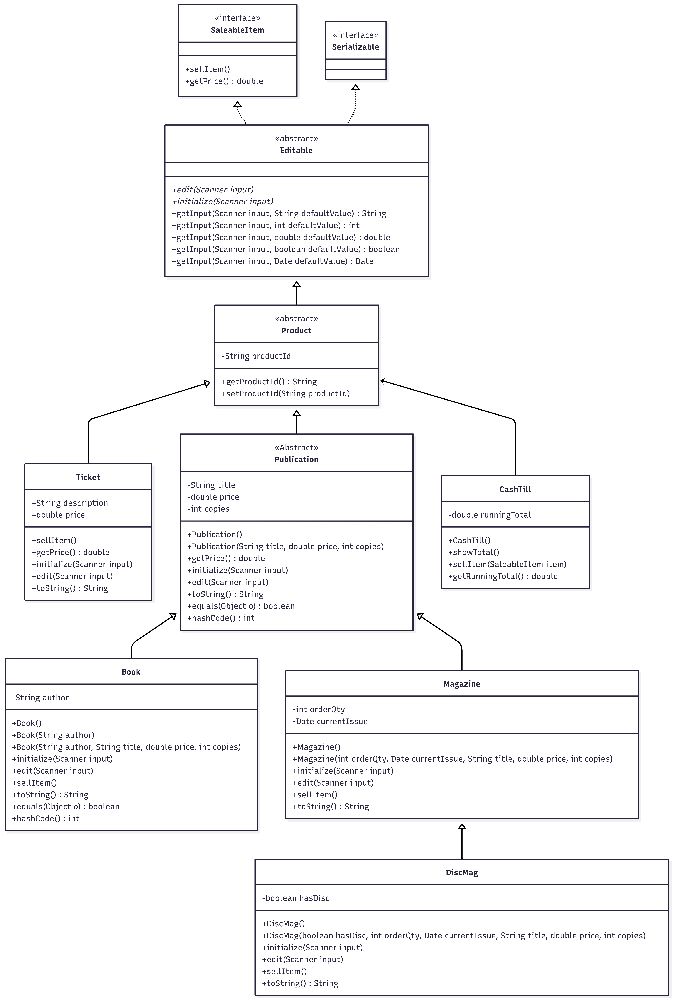

***

## 🛑 CSD214 S26 Lecture 8: Services, Inversion of Control (IoC) & Dependency Injection
This repository is the teachers code for **Lecture 8 In-Class Exercise**. Building upon the Repository Pattern established in previous weeks, we are now transitioning from tightly coupled presentation controllers to a structured, layered architecture using **Specialist Services**, **Inversion of Control (IoC)**, and **Constructor Dependency Injection (DI)** [6].
#### Lecture 8
> [CSD214 Lecture 8...](https://docs.google.com/document/d/1V9ipKEdnvaSJCQfn-0x0f76xIqMn29Jiy1FB05FBfmg/edit?usp=sharing)
### **Service & Abstraction Overview**
The `bookstore.services` package introduces the business logic layer ("The Chef") of our application, isolating core transaction validation from both the user interface and database engines [6]:

*   **The Service Layer (Outcome 4.2):** Houses pure domain rules (e.g., processing polymorphic sales, applying custom pricing discounts, and verifying safety tolerances) cleanly isolated from `Scanner` and CLI presentation code [6].
*   **Inversion of Control (IoC):** Shifts object lifecycle management. Our classes no longer construct their own dependencies (eliminating the tight coupling of the `new` keyword). `Main.java` acts as a manual container to assemble and wire objects [6].
*   **Dependency Injection (DI):** Uses Constructor Injection to pass database repositories and specialized services downward, making testing highly agile and decoupled [6, 7].
*   **Polymorphic Testing (Outcome 1.5):** Proves modularity by enabling unit tests using an in-memory repository without requiring a live database connection or network overhead [6, 7].
 
***
***

# Bookstore CLI Application
- for the csd214 course summer 26 delivery: [course outline](https://welearn.saultcollege.ca/shared/CourseOutlines/csd214_Course_Outline.pdf)
> - [git repository](https://github.com/fcarella/lab1-exercise-fred-carella-csd214-s26)
> - [based on bookstore (git repository): ](https://github.com/fcarella/bookstore-2026-01-30)
> - [this exercise is covered in this lecture...](https://github.com/fcarella/csd214-s26-lecture8-services-ioc)
- A console-based Java application for managing a bookstore inventory, performing sales, and tracking cash flow. This project demonstrates object-oriented programming concepts including inheritance, polymorphism, and interface implementation in Java 25.

## Features

*   **Inventory Management (Polymorphic DTO Layer):**
    *   **Books:** Manage items with Title, Author, Price, and Copies.
    *   **Magazines:** Manage periodicals with Order Quantity and Issue Date.
    *   **Disc Magazines:** Specialized magazines that include a disc.
    *   **Tickets:** Simple saleable items with a description and price.
    *   **Vehicle Parts (Lab 1 Exercise):** Expanded inventory to include **Tires** (Diameter) and **Batteries** (Cold Cranking Amps) via a new Automotive hierarchy.
*   **Business Logic Abstraction (Service Layer):**
    *   Isolates business calculations and validations from the CLI interface [6].
    *   Provides general store processing through `BookstoreService` [6].
    *   Provides specialized automotive validation rules through `AutomotiveService` [6].
*   **Data Access Abstraction (Repository Pattern):**
    *   Clean separation of presentation logic (DTOs) from database schemas (Entities) [6].
    *   A generic repository contract (`IRepository`) to standardise CRUD lifecycle operations [6].
    *   Encapsulated Hibernate transactions and "Upsert" logic within the data layer [6].
*   **CRUD Operations:** Create, Read, Update, and Delete items.
*   **Sales System:** Sell items to decrement inventory count and increase the Cash Till total.
*   **Data Generation:** Uses `JavaFaker` to populate the database with realistic dummy data for both Bookstore and Auto-Shop departments.
*   **Menu System:** Interactive console menu for navigation.

## Class Hierarchy



The hierarchy implements the following structure:
*   **SaleableItem (Interface):** Defines `sellItem()` and `getPrice()`.
*   **Editable (Abstract):** Handles console input/output and parsing.
*   **Publication:** Base class for Books and Magazines (Title, Price, Copies).
*   **VehiclePart (Lab 1 Exercise):** Base abstract class for the automotive department (Manufacturer, Price).
    *   `Tire` and `Battery` concrete classes implement specific automotive attributes.

## Prerequisites

*   **Java JDK:** Version 25
*   **Maven:** 3.6+
*   **Docker Desktop:** To host containerized MySQL

## Dependencies

*   [JavaFaker](https://github.com/DiUS/java-faker) (1.0.2): For generating random test data.
*   [JUnit 5](https://junit.org/junit5/) (5.10.0): For unit testing.
*   [MySQL Connector/J](https://dev.mysql.com/downloads/connector/j/) (8.2.0): To establish connection driver channels.
*   [Hibernate Core](https://hibernate.org/) (6.6.1.Final): JPA Implementation engine.
*   [H2 Database Engine](https://www.h2database.com/) (2.2.224): In-Memory database for local transient operations.

## How to Run

1.  **Start your database container:**
    ```bash
    docker-compose up -d
    ```

2.  **Compile the project:**
    ```bash
    mvn clean compile
    ```

3.  **Run the application:**
    ```bash
    mvn exec:java -Dexec.mainClass="bookstore.Main"
    ```

## Usage

Upon starting, the application will automatically populate the database if it detects an empty schema. You will see the following menu:

```text
***********************
 1. Add Items (Repository Save)
 2. Edit Items (Repository Save/Update)
 3. Delete Items (Repository Delete)
 4. Sell item(s) (Service-Driven Sale)
 5. List items (Polymorphic Filtering)
99. Quit
***********************
```

*   **Add Items:** Choose a specific type (Book, Magazine, Tire, Battery, etc.) and follow the prompts.
*   **Edit Items:** Select an index from the database records to modify fields.
*   **Sell Items:** Select an index to sell. This delegates transaction logic directly to the service layer to modify the inventory count safely [6].

## Running Tests

Unit and integration tests are implemented using JUnit 5 to verify the logic of services, POJOs, entity mappings, and input mocking [6].

Run the tests using Maven:

```bash
mvn test
```

## Project Structure

```
src/
├── main/
│   ├── java/
│   │   └── bookstore/
│   │       ├── Main.java           # Manual IoC Assembler (Wiring Phase) [6]
│   │       ├── App.java            # Controller / Menu Logic (Injected with Services) [6]
│   │       ├── entities/           # JPA Entities (Pure DB Mapping)
│   │       │   ├── ProductEntity.java
│   │       │   ├── BookEntity.java
│   │       │   └── ...
│   │       ├── pojos/              # Presentation DTOs (Editable Input)
│   │       │   ├── Book.java
│   │       │   ├── Tire.java
│   │       │   └── ...
│   │       ├── repositories/       # Abstraction & Persistence Layer
│   │       │   ├── IRepository.java
│   │       │   └── ProductRepository.java
│   │       └── services/           # Business Logic Layer (The "Chefs") [6]
│   │           ├── BookstoreService.java
│   │           └── BatteryService.java
│   └── resources/
│       └── META-INF/
│           └── persistence.xml     # JPA Persistence Context (MySQL & H2) [7]
└── test/
    └── java/
        └── bookstore/
            ├── AppTest.java        # Integration Test (Mock System.in)
            └── services/           # Unit Tests [6]
                └── BookstoreServiceTest.java
```
```
***
